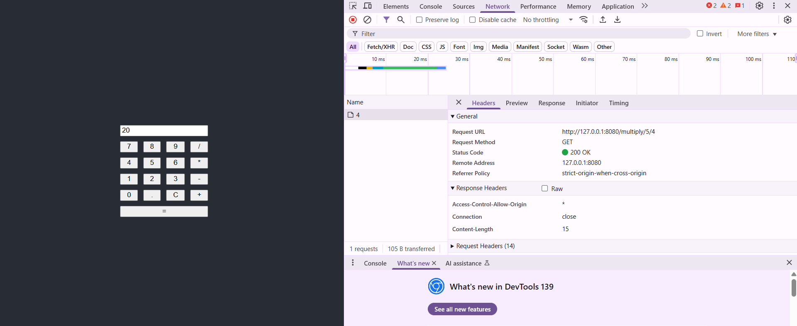

## Table of Contents

- [Introduction](#introduction)
- [Calculator Front-end](#calculator-front-end)
  - [What is React?](#what-is-react)
  - [What is Node.js?](#what-is-nodejs)
  - [What is npm?](#what-is-npm)
  - [Install Node.js and npm](#install-nodejs-and-npm)
  - [Install React](#install-react)
  - [Run the Front-end](#run-the-front-end)
- [Calculator Back-end](#calculator-back-end)
  - [What is restbed?](#what-is-restbed)
  - [Install restbed](#install-restbed)
  - [Install a C++ compiler](#install-a-c-compiler)
  - [Install cmake](#install-cmake)
  - [Create calculator web API application](#create-calculator-web-api-application)
  - [Build calculator Back-end](#build-calculator-back-end)

## Introduction

It is a self contained `C++` and `React` based simple calculator web application which has
two parts:

* calculator_front-end
* calculator_back-end

In `calculator_front-end` it uses [`React`](https://reactjs.org/) to implement
the calculator web interface and in `calculator_back-end` it uses
[`restbed`](https://github.com/Corvusoft/restbed) `C++` framework to implement
calculator web API.  

## calculator Front-end

I'm going to use [`React`](https://reactjs.org/) to implement the calculator
user interface.

### What is `React`

`React` is a `JavaScript` library for building interactive web user interfaces.
In order to use `React` or any tools based in `JavaScript`, you’ll need to know
how to use npm and Node.js.

### What is `Node.js`

`JavaScript` is a client-side programming language, which means it's processed
in the browser. With `Node.js` `JavaScript` can also be used outside the
browser.

### What is `npm`

`npm` is a tool to download and install `Node.js` programs, plugins, modules
and so on.

### Install `Node.js` and `npm`

Read the following article to install and use`Node.js` and `npm`.  
[How to Install and Use Node.js and npm (Mac, Windows, Linux)](https://www.taniarascia.com/how-to-install-and-use-node-js-and-npm-mac-and-windows/)

### Install `React`

Now, to install `React`, run the following command in the terminal:  
`npm install -g create-react-app`  

If successful, you should be able to get version:  
`npm create-react-app --version`  

### Run the Front-end


```sh
cd calculator_front-end
npm install
export NODE_OPTIONS=--openssl-legacy-provider
npm start
```

Once you run this command, a new window will popup at `localhost:3000` with calculator react app

## calculator Back-end

We're going to use `restbed` C++ framework to implement calculator web API.  

### What is `restbed`

The `restbed` is a C++11 framework which enables us to implement RESTful web
APIs.  
We're going to implement calculator web API in the form of a JSON web API. So
we need a C++ JSON Library. There are a lot of JSON libraries, We’ve selected
`JSON library for modern C++`.

### Install `restbed`

If you have a `Linux` machine, you can run the following command in the
terminal to install `restbed`:  

```sh
sudo apt-get update
sudo apt install librestbed-dev
```

For newer version of Ubuntu or for Windows you can build and install it through `cmake`, read `restbed`
[documentation for details](https://github.com/Corvusoft/restbed).  

### Install a C++ compiler

`C++` codes need to compile. So we need a `C++` compiler.  
If you have a linux machine, you might have `GCC`.  Also you can install
`Visual C++` for `Windows` or `clang` for `mac os`.

### Install `cmake`

If you have a `Linux` machine, you can run the following command in the
terminal to install `cmake`:  

`sudo apt-get install cmake`

Otherwise you can install it through [this link](https://cmake.org/download/).  

### Create calculator web API application

Run commands on terminal

```sh
cd ..
mkdir calculator_back-end
```

### build calculator Back-end


```sh
export LIBRARY_PATH=<Directly where restbed is built>/restbed/distribution/library:$LIBRARY_PATH
cmake -DCMAKE_CXX_FLAGS="-I<Directly where restbed is built>/restbed/distribution/include" ..
make
```

Now you can run calculator API through running following command in the
terminal:  

```sh
./CalculatorAPI
```


Below is a screenshot of the calculator web application in use:

